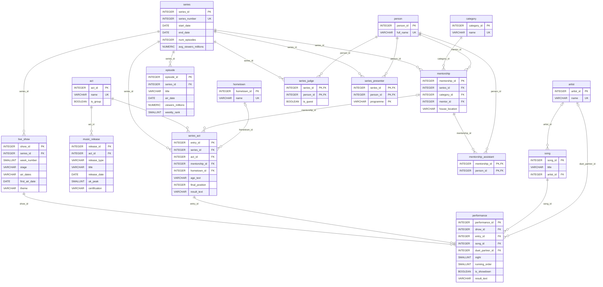

# Entity-relationship diagram

Generated from the SQLAlchemy models by `python -m xfactor.erd`. Open `erd.drawio` in [draw.io](https://app.diagrams.net) for the editable version.

```mermaid
erDiagram
    act {
        INTEGER act_id PK
        VARCHAR name UK
        BOOLEAN is_group
    }
    artist {
        INTEGER artist_id PK
        VARCHAR name UK
    }
    category {
        INTEGER category_id PK
        VARCHAR name UK
    }
    hometown {
        INTEGER hometown_id PK
        VARCHAR name UK
    }
    person {
        INTEGER person_id PK
        VARCHAR full_name UK
    }
    series {
        INTEGER series_id PK
        INTEGER series_number UK
        DATE start_date
        DATE end_date
        INTEGER num_episodes
        NUMERIC avg_viewers_millions
    }
    episode {
        INTEGER episode_id PK
        INTEGER series_id FK
        VARCHAR title
        DATE air_date
        NUMERIC viewers_millions
        SMALLINT weekly_rank
    }
    live_show {
        INTEGER show_id PK
        INTEGER series_id FK
        SMALLINT week_number
        VARCHAR stage
        VARCHAR air_dates
        DATE first_air_date
        VARCHAR theme
    }
    mentorship {
        INTEGER mentorship_id PK
        INTEGER series_id FK
        INTEGER category_id FK
        INTEGER mentor_id FK
        VARCHAR house_location
    }
    music_release {
        INTEGER release_id PK
        INTEGER act_id FK
        VARCHAR release_type
        VARCHAR title
        DATE release_date
        SMALLINT uk_peak
        VARCHAR certification
    }
    series_judge {
        INTEGER series_id PK,FK
        INTEGER person_id PK,FK
        BOOLEAN is_guest
    }
    series_presenter {
        INTEGER series_id PK,FK
        INTEGER person_id PK,FK
        VARCHAR programme PK
    }
    song {
        INTEGER song_id PK
        VARCHAR title
        INTEGER artist_id FK
    }
    mentorship_assistant {
        INTEGER mentorship_id PK,FK
        INTEGER person_id PK,FK
    }
    series_act {
        INTEGER entry_id PK
        INTEGER series_id FK
        INTEGER act_id FK
        INTEGER mentorship_id FK
        INTEGER hometown_id FK
        VARCHAR age_text
        INTEGER final_position
        VARCHAR result_text
    }
    performance {
        INTEGER performance_id PK
        INTEGER show_id FK
        INTEGER entry_id FK
        INTEGER song_id FK
        INTEGER duet_partner_id FK
        SMALLINT night
        SMALLINT running_order
        BOOLEAN is_showdown
        VARCHAR result_text
    }
    series ||--o{ episode : "series_id"
    series ||--o{ live_show : "series_id"
    series ||--o{ mentorship : "series_id"
    category ||--o{ mentorship : "category_id"
    person ||--o{ mentorship : "mentor_id"
    act ||--o{ music_release : "act_id"
    series ||--o{ series_judge : "series_id"
    person ||--o{ series_judge : "person_id"
    series ||--o{ series_presenter : "series_id"
    person ||--o{ series_presenter : "person_id"
    artist |o--o{ song : "artist_id"
    mentorship ||--o{ mentorship_assistant : "mentorship_id"
    person ||--o{ mentorship_assistant : "person_id"
    series ||--o{ series_act : "series_id"
    act ||--o{ series_act : "act_id"
    mentorship |o--o{ series_act : "mentorship_id"
    hometown |o--o{ series_act : "hometown_id"
    live_show ||--o{ performance : "show_id"
    series_act ||--o{ performance : "entry_id"
    song ||--o{ performance : "song_id"
    artist |o--o{ performance : "duet_partner_id"
```
